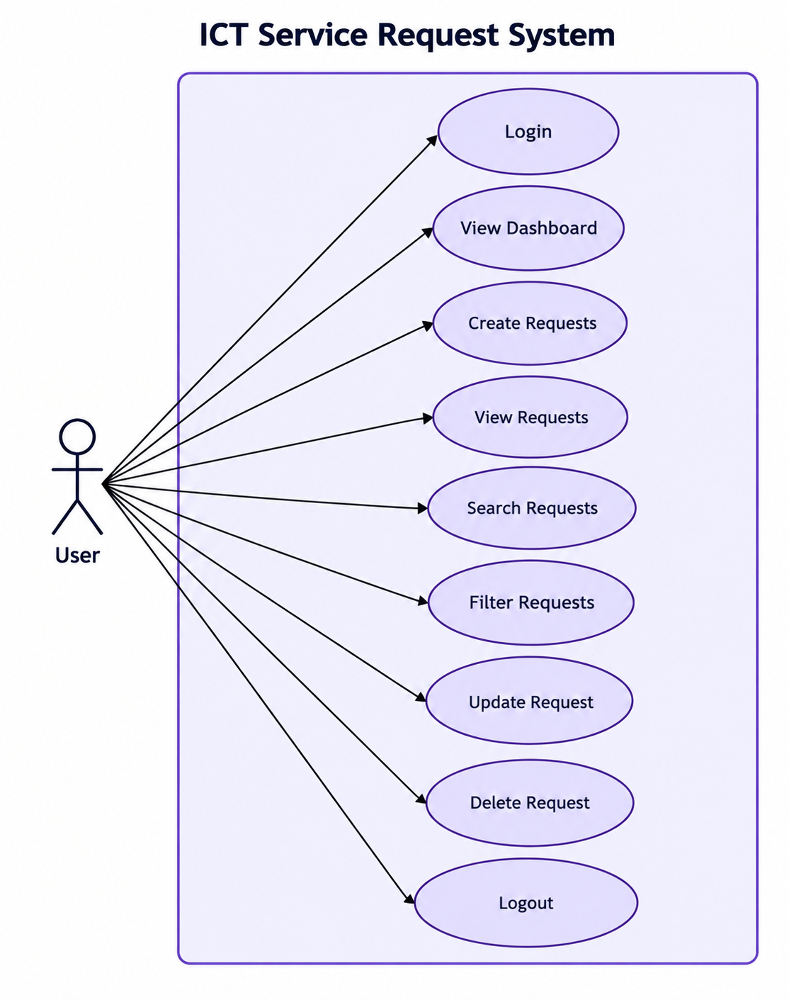

# ICT Service Request Management System

A small web-based system for a university ICT office to record and manage technical support requests, developed for Laboratory Exercise 3 (Systems Analysis and Design). The system provides a centralized platform for users to create, view, search, filter, update, and delete ICT service requests.

The front end is developed using HTML, CSS, and JavaScript and is hosted on GitHub Pages.

Full Systems Analysis and Design documentation, including the problem statement, actors, use cases, use case diagram, ERD, requirements, business rules, and testing, is available in [`documentation/system-analysis.md`](documentation/system-analysis.md).

---

## 1. Problem Statement

The ICT office receives technical concerns through verbal requests, text messages, and social media. Because requests come from different sources, some concerns may be forgotten, duplicated, or not properly monitored. The proposed Online Service Request Management System provides a centralized platform where users can submit, view, search, filter, update, and delete ICT service requests. The system also allows users to monitor the status and priority of requests, making the handling of technical concerns more organized, accessible, and efficient.

See [`documentation/system-analysis.md`](documentation/system-analysis.md) for the complete system analysis.

---

## 2. Use Case Diagram

The Use Case Diagram shows how the System User / ICT Personnel interacts with the functions of the system.



[View Use Case Diagram](documentation/use-case-diagram.png)

---

## 3. Entity Relationship Diagram (ERD)

The ERD shows the relationship between users and service requests in the system.


[View ERD](documentation/erd.png)

The main relationship is:

```text
USER 1 ───────── M SERVICE_REQUEST

4. Project Structure
SAD-ServiceRequest-Francisco/
│
├── index.html                  # Dashboard + CRUD table + search/filter
├── login.html                  # Login page
│
├── css/
│   └── style.css               # System styling
│
├── js/
│   ├── supabase.js             # Database client configuration
│   ├── auth.js                 # Login, logout, and session handling
│   └── app.js                  # Dashboard, CRUD, search, filter, validation
│
├── documentation/
│   ├── system-analysis.md      # Complete SAD documentation
│   ├── erd.png                 # Entity Relationship Diagram
│   └── use-case-diagram.png    # Use Case Diagram
│
└── README.md                   # Project documentation

5. Main Features

The system provides the following features:

User Login
User Logout
Session Management
Dashboard
Create Service Request
View Service Requests
Update Service Request
Delete Service Request
Search Service Requests
Filter by Status
Filter by Priority
Combined Search and Filtering
Dashboard Request Statistics
Input Validation
Access Control
Service Request Categories
Computer Repair
Software Installation
Internet/Network Problem
Printer Problem
Account/Access Concern
Other ICT Concerns
Request Priority
Low
Medium
High
Request Status
Pending
In Progress
Completed

New requests automatically receive a Pending status.

6. Deployment — GitHub Pages

The system is deployed using GitHub Pages.

Deployment Configuration
Push the project to GitHub.
Open the repository.
Go to Settings → Pages.
Under Build and deployment, select:
Source: Deploy from a branch
Branch: main
Folder: /(root)
Save the settings.
Wait for the deployment to finish.
Open the deployed system.
Live System

Open ICT Service Request Management System

The root URL opens the login page. After successful login, the user is redirected to the dashboard.

7. Requirements Traceability Matrix
Req. ID	Requirement	System Feature	Test
FR-01	User can log in	login.html, auth.js	TC-01
FR-02	User can create a request	Request Form, app.js	TC-02
FR-03	User can view requests	Request Table, app.js	TC-03
FR-04	User can update a request	Edit Function, app.js	TC-04
FR-05	User can delete a request	Delete Function, app.js	TC-05
FR-06	User can search requests	Search Function, app.js	TC-06
FR-07	User can filter requests	Status/Priority Filters	TC-07
FR-08	System displays summaries	Dashboard Statistics	TC-08

The complete requirements traceability and business rules are documented in documentation/system-analysis.md.

8. Functional Testing
Test ID	Test Scenario	Expected Result	Result
TC-01	Login using valid account	Dashboard appears	PASS
TC-02	Submit valid request	Request is saved	PASS
TC-03	Display requests	Existing records appear	PASS
TC-04	Modify request	Changes are saved	PASS
TC-05	Delete request	Confirmation appears and record is removed	PASS
TC-06	Search requester	Matching records are displayed	PASS
TC-07	Filter by status and priority	Matching records are displayed	PASS
TC-08	Open deployed URL	Application loads online	PASS

Test results should only be marked PASS after the corresponding function has been successfully tested.

9. Business Rules

The system follows these business rules:

Users must log in before accessing the dashboard.
Requester name is required.
Department is required.
A category must be selected.
The description must contain sufficient information.
Priority must be Low, Medium, or High.
New requests automatically receive a Pending status.
The date and time are automatically recorded.
Users must confirm before deleting a request.
Unauthorized database modifications are prevented through access control.

The complete business rules are available in documentation/system-analysis.md.

10. CRUD Operations

The system implements the four basic CRUD operations:

Create

Users can submit a new ICT service request using the request form.

Read

Users can view existing service requests in the request table.

Update

Users can edit an existing service request and save the changes.

Delete

Users can delete a service request after confirming the deletion.

11. Search and Filtering

The system provides search and filtering functions.

Search

Users can search requests using:

Requester Name
Description
Status Filter

Users can filter requests by:

All
Pending
In Progress
Completed
Priority Filter

Users can filter requests by:

All
Low
Medium
High

Search, status, and priority filters can be combined to find specific service requests.

12. Dashboard

The dashboard provides a summary of the service requests through the following statistics:

Total Requests
Pending Requests
In Progress Requests
Completed Requests

The displayed statistics are automatically updated based on the service request records.

13. System Analysis Documentation

The complete Systems Analysis and Design documentation is available here:

View Complete System Analysis

The documentation includes:

Problem Statement
Objectives
Scope
Actors
Use Cases
Use Case Diagram
Functional Requirements
Non-Functional Requirements
Database Design
Entity Relationship Diagram
Business Rules
CRUD Operations
Search and Filtering
Dashboard
Authentication and Access Control
System Architecture
Requirements Traceability Matrix
Functional Testing
Conclusion
14. Technologies Used
HTML
CSS
JavaScript
PostgreSQL Database
Authentication
Git
GitHub
GitHub Pages
15. GitHub Repository

The complete source code and documentation are available in the GitHub repository:

View GitHub Repository

The repository contains:

Source code
Login page
Dashboard
CRUD functions
Search and filtering
System analysis documentation
ERD
Use Case Diagram
README documentation
