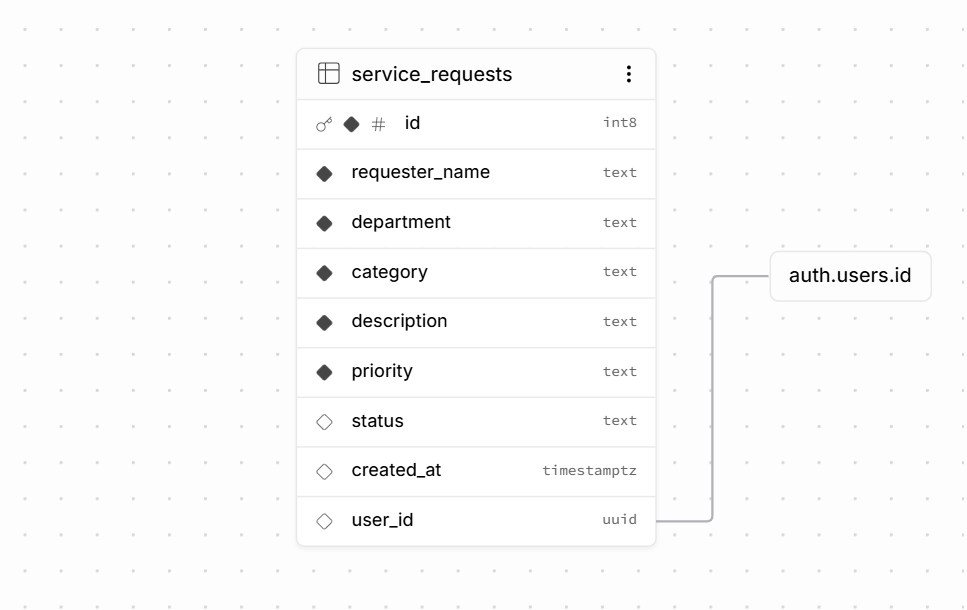

# ICT Service Request Management System

A small web-based system for a university ICT office to record and manage technical support requests, built for Laboratory Exercise 3 (Systems Analysis and Design). The front end uses HTML, CSS, and JavaScript and is hosted on GitHub Pages. Data storage, authentication, and access control are handled using Supabase.

Full SAD analysis, including the problem statement, actors, use case diagram, ERD, requirements, business rules, and testing, is available in [`documentation/system-analysis.md`](documentation/system-analysis.md).

---

## 1. Problem Statement

The ICT office receives technical concerns through verbal requests, text messages, and social media. Because requests come from different sources, some concerns may be forgotten, duplicated, or not properly monitored. The proposed Online Service Request Management System provides a centralized platform where users can submit, view, search, filter, update, and delete ICT service requests. The system also allows users to monitor the status and priority of requests, making the handling of technical concerns more organized, accessible, and efficient.

See [`documentation/system-analysis.md`](documentation/system-analysis.md) for the complete system analysis.

---

## 2. ERD

The Entity Relationship Diagram shows the relationship between users and service requests in the system.



[View ERD](documentation/erd.png)

The main relationship is:

```text
USER 1 ───────── M SERVICE_REQUEST
3. Use Case Diagram

The Use Case Diagram shows how the System User / ICT Personnel interacts with the different functions of the ICT Service Request Management System.

View Use Case Diagram

The main use cases include:

Login
View Dashboard
Create Request
View Requests
Search Request
Filter Requests
Update Request
Delete Request
Logout
4. Project Structure
SAD-ServiceRequest-Francisco/
│
├── index.html                  # Dashboard + CRUD table + search/filter
├── login.html                  # Login page
│
├── css/
│   └── style.css               # System styling
│
├── js/
│   ├── supabase.js             # Supabase client configuration
│   ├── auth.js                 # Login, logout, and session handling
│   └── app.js                  # Dashboard, CRUD, search, filter, validation
│
├── documentation/
│   ├── system-analysis.md      # Complete SAD documentation
│   ├── erd.png                 # Entity Relationship Diagram
│   └── use-case-diagram.png    # Use Case Diagram
│
└── README.md                   # Project documentation
5. Main Features

The system provides the following features:

User Login
User Logout
Session Management
Dashboard
Create Service Request
View Service Requests
Update Service Request
Delete Service Request
Search Service Requests
Filter by Status
Filter by Priority
Combined Search and Filtering
Dashboard Request Statistics
Input Validation
Access Control
Service Request Categories
Computer Repair
Software Installation
Internet/Network Problem
Printer Problem
Account/Access Concern
Other ICT Concerns
Request Priority
Low
Medium
High
Request Status
Pending
In Progress
Completed

New service requests automatically receive a Pending status.

6. Deployment (GitHub Pages)

The system is deployed using GitHub Pages.

Deployment Steps
Push the project repository to GitHub.
Open the repository's Settings.
Select Pages.
Under Build and deployment, select Deploy from a branch.
Select the main branch.
Select the /(root) folder.
Save the settings.
Wait for GitHub Pages to finish deploying.
Open the deployed system.
Live System

Open ICT Service Request Management System

The root URL opens the login page. After successful login, the user is redirected to the dashboard.

7. Requirements Traceability Matrix
Req. ID	Requirement	System Feature	Test
FR-01	User can log in	login.html, auth.js	TC-01
FR-02	User can create a request	Request Form, app.js	TC-02
FR-03	User can view requests	Request Table, app.js	TC-03
FR-04	User can update a request	Edit Function, app.js	TC-04
FR-05	User can delete a request	Delete Function, app.js	TC-05
FR-06	User can search requests	Search Function, app.js	TC-06
FR-07	User can filter requests	Status and Priority Filters	TC-07
FR-08	System displays summaries	Dashboard Statistics	TC-08

The complete requirements traceability matrix and business rules are documented in documentation/system-analysis.md.

8. Functional Testing
Test ID	Test Scenario	Expected Result	Result
TC-01	Login using valid account	Dashboard appears	PASS
TC-02	Submit valid request	Request is saved	PASS
TC-03	Display requests	Existing records appear	PASS
TC-04	Modify request	Changes are saved	PASS
TC-05	Delete request	Confirmation appears and record is removed	PASS
TC-06	Search requester	Matching records are displayed	PASS
TC-07	Filter by status and priority	Matching records are displayed	PASS
TC-08	Open deployed URL	Application loads online	PASS

Test results should only be marked PASS after the corresponding function has been successfully tested.

9. System Documentation

The complete Systems Analysis and Design documentation is available in:

documentation/system-analysis.md

The documentation contains:

Problem Statement
System Objectives
Scope
Actors
Use Cases
Use Case Diagram
Functional Requirements
Non-Functional Requirements
Database Design
Entity Relationship Diagram
Business Rules
CRUD Operations
Search and Filtering
Dashboard
Authentication and Access Control
System Architecture
Requirements Traceability Matrix
Functional Testing
Conclusion

The repository also contains the system diagrams:

documentation/erd.png
documentation/use-case-diagram.png
10. Security Notes
Authentication is required before accessing the main dashboard.
User sessions are managed through the authentication system.
Row Level Security (RLS) is enabled for the service request data.
Database access is controlled through authenticated user policies.
Users can only modify service requests that they are authorized to modify.
Input validation is implemented for required fields.
Delete operations require confirmation before removing a request.
The Supabase service_role key is not exposed in the front-end application.
Passwords and test account credentials are not included in this README.